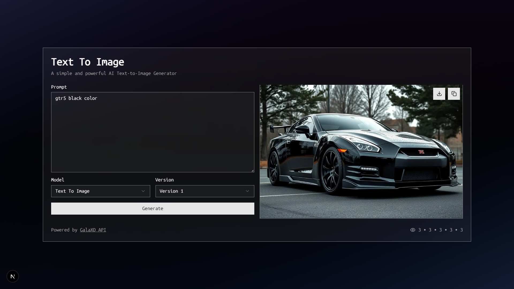

# 🖼️ Text to Image Generator



A simple and powerful **AI Text-to-Image Generator** built with **Next.js App Router**.
This tool allows users to generate high-quality images from text prompts with support for multiple models and versions.

---

## 🚀 Features

- ✍️ Generate images from any text prompt
- 🎨 Choose different models (Flux, Stable Diffusion, Pollinations, etc.)
- 🔢 Version selection (for `text2img` models)
- 📷 Instant preview after generation
- 📥 Download or copy image URL easily
- ⚡ Built with Next.js 15+ App Router

---

## 🛠️ Environment Configuration

Create a `.env` file in the root directory and add your Text2Img credentials:

```env
UNIVERSE_API_KEY=YOUR_API_KEY_HERE
NEXT_PUBLIC_VISITOR_TRACKING_ID=YOUR_ID_HERE
```

---

🔍 How to get these values:
You can find them in your Universe API dashboard:
- 🔗 [Go to Dashboard → Settings](https://api.galaxd.com/dashboard)
    - UNIVERSE_API_KEY → Select `Settings > API Key > Copy`
- 🔗 [Go to Visitor Counter](https://visitorcounter.galaxd.com/)
    - NEXT_PUBLIC_VISITOR_TRACKING_ID → Input whitelist domain > Generate

---

## 💡 Usage
1. Enter a prompt in the text area (e.g., _"A futuristic cityscape at night with neon lights"_)
2. Select the model you want to use
3. (Optional) Select version if you choose text2img
4. Click Generate
5. Preview the result, download the image, or copy the image URL

---

## 📌 Notes
- Image generation speed depends on the selected model
- Some models may require credits or API limits
- Handle errors gracefully (e.g., invalid key, quota exceeded)